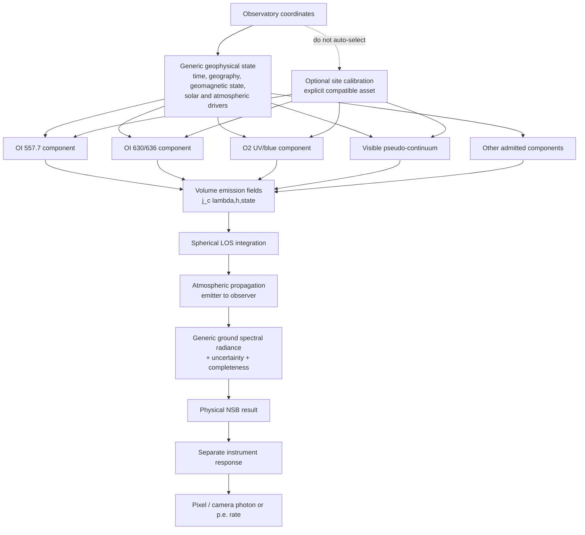

# Investigación profunda para el nuevo modelo genérico de Airglow de NSB

**Fecha:** 2026-09-29  
**Issue:** #200 — Airglow: decouple generic core data from observatory calibration  
**Estado:** Deep Research report

## 1 — Executive conclusion

**Decisión: NO-GO para admitir hoy `GenericAirglowV1` como modelo de producción capaz de cerrar de forma defendible el broadband 300–650 nm. GO para construir inmediatamente un prototipo científico reproducible que resuelva las líneas atómicas y pruebe, sin ocultar huecos, el cierre del continuo.**

La arquitectura vinculante de NSB es científicamente correcta: el modelo genérico, la calibración de observatorio y la respuesta instrumental deben ser objetos distintos; Paranal no debe conservar ningún papel privilegiado, la ausencia de calibración debe ser una situación normal, y una coordenada nunca debe actuar como evidencia de calibración. Es exactamente la dirección exigida por #200. El epic #145 ya adopta además como requisito que el asset genérico sea independiente de observatorio en significado científico, reproducible en origen y fabricación, y que el antiguo camino Paranal desaparezca de producción.

**EVIDENCE.** A septiembre de 2026 sí existen observaciones globales o cuasi-globales suficientes para construir partes de un modelo por componentes: WINDII proporciona perfiles de emisión óptica y una climatología histórica útil de O I 557.7 nm; ICON/MIGHTI proporciona perfiles modernos de 557.7 y 630.0 nm y su variabilidad; SABER, OSIRIS, SCIAMACHY y NRLMSIS aportan restricciones sobre O, O2, O3, temperatura y estructura mesosférica; WACCM/WACCM-X y GLOW pueden funcionar como modelos de estado/driver físico.

**EVIDENCE.** El problema crítico sigue siendo el continuo/pseudocontinuo. El análisis de diez años de espectros X-shooter de Noll et al. separa componentes asociados a FeO visible, O2 UV/blue y otros continuos, pero la explicación físico-química no cierra cuantitativamente la intensidad observada: la simulación WACCM de FeO alcanza aproximadamente 170 R mientras el componente visible correlacionado empíricamente es del orden de 2.9 kR; incluso añadiendo la contribución OFeOH discutida, el déficit sigue siendo grande. Por tanto, **reproducir la forma o la variabilidad de un mecanismo no equivale a explicar su radiancia absoluta**.

**EVIDENCE.** PALACE v1.0 demuestra que un modelo semiempírico detallado puede cerrar muy bien un conjunto espectroscópico de Paranal: utiliza X-shooter/UVES, decenas de miles de líneas, varios continuos y dependencias de hora local, estación y actividad solar. Pero es explícitamente un modelo construido para Cerro Paranal, de modo que constituye una extraordinaria referencia para una futura `ParanalAirglowCalibration` y para estudiar taxonomía espectral, no una justificación para promover sus amplitudes o climatologías al core genérico.

**INFERENCE.** La frontera científica no está, por tanto, en Rust ni en la geometría. Está en esta pregunta experimental:

> ¿Puede una combinación **sin normalización a ningún observatorio** de observaciones satelitales absolutas, perfiles verticales y drivers atmosféricos explicar la radiancia terrestre 300–650 nm observada independientemente en varios lugares, incluyendo los continuos?

Hoy la respuesta verificable es **“todavía no está demostrado”**.

La decisión propuesta es:

```text
NO-GO:
    GenericAirglowV1 como modelo production/admitted de 300–650 nm

GO:
    GenericAirglowResearchV0
        ├── OI_5577               observationally anchored
        ├── OI_630_636            experimental/physics-assisted
        ├── O2_UV_BLUE            experimental
        ├── FE_O_VIS_CONTINUUM     experimental
        ├── MINOR_LINES            only when traceable
        └── UNMODELLED_RESIDUAL    explicitly represented, never interpolated away
```

El prototipo debe poder producir resultados parciales, pero con una **máscara de completitud científica** que impida interpretar una suma incompleta como “Airglow 300–650 nm”.

### Arquitectura recomendada



**RECOMMENDATION.** `airglow_cont.dat` y `ParanalNollSkyCalcFors1` no deben convertirse en el punto inicial del prototipo nuevo. Deben permanecer solamente como evidencia histórica durante la migración y desaparecer del camino runtime cuando exista un reemplazo admitido, exactamente como exige #200/#145.

## 2 — Estado científico actual

El campo puede dividirse en tres niveles de madurez que no conviene mezclar.

| Nivel | Estado en 2026 | Implicación para NSB |
|---|---|---|
| Líneas ópticas atómicas principales | **Relativamente maduro** en identidad espectral y estructura vertical; hay climatologías/perfiles satelitales | Se puede prototipar un modelo genérico trazable |
| Drivers mesosféricos/termosféricos | **Maduro como estado atmosférico**, no necesariamente como predictor de radiancia absoluta | SABER, NRLMSIS, WACCM-X, GLOW son drivers, no ground truth radiométrico |
| Continuos 300–650 nm | **No cerrado físicamente en intensidad absoluta global** | Principal blocker de `GenericAirglowV1` |

WINDII midió airglow visible desde UARS entre aproximadamente 80 y 300 km y produjo perfiles de emission rate, incluyendo estudios específicos de 557.7 nm; su larga climatología orbital resulta valiosa aunque corresponde a 1991–1997 y presenta el patrón de cobertura latitudinal impuesto por la órbita.

ICON/MIGHTI ofrece una comprobación mucho más reciente de la estructura vertical de 557.7 y 630.0 nm, con productos archivados oficialmente en NASA/SPDF. Sin embargo, publicaciones recientes de la propia misión advierten que determinadas recuperaciones de MIGHTI se explotan como **relative VER** y que la radiancia absoluta no debe darse por conocida automáticamente; esto impide usar MIGHTI sin más como ancla absoluta universal.

SABER no observa directamente el espectro óptico 300–650 nm: es un limb sounder infrarrojo que proporciona, entre otros productos, temperatura, O3 y emisiones de O2/OH, de las que se pueden derivar restricciones de oxígeno atómico. Por eso es un driver excelente para química/estado atmosférico, pero no una medida de radiancia visible absoluta.

NRLMSIS 2.0 aporta temperatura y composición neutra desde la atmósfera baja hasta la exosfera, con dependencias de posición, fecha/hora, F10.7 y actividad geomagnética. Incluyó nuevas restricciones de oxígeno atómico en la MLT, pero su propio artículo documenta limitaciones y herencia de partes del modelo termosférico anterior. Debe tratarse como **prior/driver climatológico**, no como un modelo de fotones de Airglow.

GLOW sí calcula ionización, excitación y volume-emission rates termosféricos a partir de estado neutro/ionosférico, por lo que encaja mejor como motor físico de O I 630 nm y de la componente termosférica de 557.7 nm. Su código utiliza entradas atmosféricas/ionosféricas externas y posee además una licencia académica propia que debe ser revisada antes de integrar código o redistribuir derivados.

La conclusión de estado científico puede condensarse así:

```text
Identidad espectral de líneas          █████  fuerte
Altura/perfiles de OI                  ████░  fuerte
Drivers globales O/T/O3                ████░  fuerte
Variabilidad de continuos              ███░░  moderada
Identidad del continuo visible         ███░░  parcial
Absoluto global del continuo           █░░░░  débil
Cierre 300–650 nm multi-site           ░░░░░  no demostrado
```

La escala es únicamente cualitativa: **no representa probabilidades ni porcentajes de incertidumbre**.

## 3 — Airglow 300–650 nm component budget

No existe una base defendible para publicar hoy un único porcentaje global de contribución de cada componente al total 300–650 nm. Esa fracción depende de latitud, hora local, estación, actividad solar/geomagnética, dirección y, en última instancia, de componentes cuyo absoluto global no está cerrado. Dar una tabla de “35 % O2, 40 % FeO…” sería precisamente la falsa precisión que #200 pretende eliminar.

| Componente | Espectro | Altitud típica / estructura | Absoluto global | Estado del budget 300–650 |
|---|---|---|---|---|
| `OI_5577` | Línea 557.7 nm bien identificada | Capa mesosférica principal, con contribuciones superiores según condiciones | Hay observaciones satelitales, pero requieren reconciliación de calibraciones | **Cerrable experimentalmente** |
| `OI_630_636` | Doblete rojo identificado | Termosfera/F-region, muy superior en altura a 557.7 | Más dependiente del estado ionosférico; MIGHTI no debe asumirse absoluto | **Needs experiment** |
| `O2_UV_BLUE` | Sistemas O2/bandas/continuo principalmente azul-UV | MLT | Separación espectral e intensidad global insuficientemente aseguradas | **Principal gap azul** |
| `FE_O_VIS_CONTINUUM` | Pseudocontinuo anaranjado con máximo amplio cerca de 595 nm | En torno a la región mesosférica ~87 km en observaciones OSIRIS | La química reproduce parte de la variabilidad, no el absoluto observado | **Principal gap visible** |
| `NA_D` y líneas menores | Líneas identificables | Mesosfera/MLT, según especie | Globalización no evaluada suficientemente para este gate | **Secundario / posterior** |
| Residual no identificado | No debe interpolarse | Desconocido por definición | Desconocido | **Bloqueante** |

OSIRIS identificó un pseudocontinuo nocturno relacionado con bandas anaranjadas de FeO, con emisión observada aproximadamente entre 540 y 680 nm, máximo amplio alrededor de 595 nm y una capa mesosférica cercana a 87 km. Otros análisis OSIRIS encontraron además una señal muy débil compatible con NiO a longitudes de onda visibles, lo que refuerza que el “continuo” no debe representarse necesariamente mediante una sola molécula ni una sola capa.

Noll et al. 2024 descompone los espectros de Paranal en varios continuos mediante NMF y encuentra que la componente denominada O2(UVB) es especialmente importante por debajo de aproximadamente 500 nm; en el intervalo de referencia 335–359 nm el análisis atribuye alrededor del 60.5 % a esa componente. Ese número es **una descomposición empírica de Paranal**, no una fracción global aplicable por NSB.

El dato más decisivo para el gate es el visible pseudocontinuum. El mismo trabajo encuentra una intensidad integrada del componente FeO(VIS) del orden de 2.9 kR mientras la simulación química WACCM asociada a FeO produce aproximadamente 170 R. La razón aproximada es sólo 170/2900 ≈ 0.059, es decir, alrededor del 6 % de la componente empíricamente atribuida. Esto no prueba que “falta un factor 17 en FeO”; prueba que **la atribución química absoluta todavía no está cerrada**.

## 4 — Latest literature review

**Noll et al. 2024 — continuum chemistry and variability.** Es el trabajo primario más importante para el blocker de NSB porque usa una década de X-shooter y combina observación con WACCM metal chemistry. Su valor para `GenericAirglow` no es proporcionar una tabla universal, sino demostrar qué componentes existen, cómo varían y, críticamente, dónde falla el cierre absoluto. DOI `10.5194/acp-24-1143-2024`.

**PALACE v1.0, 2025.** Constituye el estado del arte semiempírico para Paranal, con líneas y continuos, dependencias temporales y estimaciones de incertidumbre; su dataset/código está archivado en Zenodo, DOI `10.5281/zenodo.14064022`. DOI del paper `10.5194/gmd-18-4353-2025`. Es una referencia excelente para especificar qué debe ser capaz de representar un esquema de componentes, pero sus amplitudes/climatologías no deben definir el modelo genérico.

**MIGHTI/ICON 2020–2026.** Los trabajos de recuperación y validación muestran que las inversiones limb dependen de la simetría del VER y tienen errores geométricos sistemáticos si el campo horizontal no es uniforme. Publicaciones de 2024–2026 aportan perfiles de 557.7/630 nm y variabilidad, pero también aclaran limitaciones de la escala absoluta en determinados productos. DOI de la metodología de error `10.1029/2020EA001164`; trabajo de 2024 `10.1029/2023JA032070`; estudio 2026 `10.1029/2025GL121614`.

**NRLMSIS 2.0, 2021.** Es el candidato natural a estado neutro climatológico ligero para un prototipo, no a radiancia. DOI `10.1029/2020EA001321`.

**WACCM/WACCM-X metal chemistry, 2021–2024.** Los modelos de whole atmosphere permiten conectar metales meteóricos, mareas, O/O3 y estado mesosférico. Son valiosos para drivers y para probar causalidad, pero la comparación de Noll 2024 demuestra por qué un resultado químico no debe convertirse automáticamente en una normalización de radiancia visible.

Los trabajos históricos siguen siendo indispensables: WINDII para climatología de 557.7, OSIRIS para FeO/NiO y perfiles del continuum, y SCIAMACHY/SABER para restricciones independientes de oxígeno. En SCIAMACHY, por ejemplo, tres proxies nocturnos de O dieron acuerdos internos del orden de 15 %, pero las comparaciones con otros productos como SABER mostraron discrepancias mayores; es un recordatorio de que “dos productos globales” no implica automáticamente una única escala absoluta. DOI `10.1029/2019GL083550`.

## 5 — Dataset/source evaluation

### Matriz científica

| Fuente | Observable principal | Especies / λ | Cobertura vertical | Geografía / hora local | Cobertura temporal | Absoluto / incertidumbre | Papel NSB |
|---|---|---|---|---|---|---|---|
| **WINDII/UARS L3 v011** | Volume emission rate, vientos/T | Visible, especialmente 557.7; instrumento ~550–780 nm | ~80–300 km | Cobertura orbital amplia pero no simultáneamente global; precesión latitudinal | 1991–1997 | Producto calibrado histórico; quality metadata del producto | Ancla histórica 557.7 + perfil |
| **OSIRIS/Odin** | Limb spectra / perfiles | ~274–810 nm; FeO continuum, O2-related observables | Estratosfera–MLT según producto | Muy buena cobertura latitudinal orbital; muestreo local-time limitado por órbita | 2001–presente/larga misión | Radiancia espectral calibrada, con stray-light/cross-calibration issues | Espectro y perfil continuum; experimento absoluto |
| **SABER/TIMED** | Limb IR VER, T, O3, O/H derivados | O2 1.27 µm, OH IR, neutral state | MLT/mesosfera-termosfera baja | Cobertura latitudinal alternante TIMED, local-time sampling por yaw cycles | 2002–presente; v2.07/v2.08 | No es radiancia visible | Driver O/T/O3 |
| **ICON/MIGHTI** | VER relativo/perfiles, winds | OI 557.7, OI 630.0, O2 A-band | ~90–300 km, dependiente de canal | Low/mid latitude ICON | 2019–2022 observación; products mantenidos/reprocesados | Escala absoluta no debe suponerse en todos los productos | Perfil/variabilidad, cross-validation |
| **SCIAMACHY/Envisat** | Limb/nightglow retrievals | 557.7, O2 A-band, OH / O | MLT | Cobertura orbital global | 2002–2012 | Útil para intercomparación, con retrieval systematics | Validation |
| **NRLMSIS 2.0** | Estado atmosférico empírico | O, O2, N2, T, etc. | superficie–exosfera | Global | Climatología/modelo | No produce radiancia Airglow | Driver |
| **WACCM6/WACCM-X** | Whole-atmosphere chemistry/dynamics | O, O3, Fe/metal chemistry, ions, etc. | Troposfera–termosfera, según configuración | Global model grid | Simulación/reanálisis específico | No debe considerarse absolute-radiance truth | Driver físico |
| **GLOW** | Excitación/ionización + VER | Airglow termosférico, incl. O | Termosfera | Cualquier columna para la que existan inputs | Modelo | Radiancia calculada, dependiente de inputs/cross sections | Driver/prototipo 630 |
| **Noll/X-shooter 2024** | Descomposición espectral observada | 300–1800 nm continuos | Inferido/relacionado con capas | Paranal | ~10 años | Excelente absoluta de un site | Evidencia/validation, no baseline |
| **PALACE 2025** | Modelo semiempírico de líneas+continuos | 0.3–2.5 µm | Por clases/componentes | **Paranal** | entrenamiento X-shooter/UVES de años | Alta calidad local | Paranal calibration/reference only |

### Matriz de adquisición, licencia y reproducibilidad

| Fuente | Producto/versión que pinnear | Formato/mecanismo | API | Licencia / redistribución | Resultado offline propuesto |
|---|---|---|---|---|---|
| WINDII | L3AT/L3AL v011 | NASA archive download; verificar contenedor exacto en spike | No necesaria runtime | **REVIEW REQUIRED** para redistribuir copia/derivado concreto | LUT compacta 557.7 + manifest |
| OSIRIS | L1 spectrograph para continuum; L2 cuando baste | L2/3 mediante SFTP/Globus; L1 espectro requiere solicitud; existen productos/sample NetCDF | No runtime | ESA/OSIRIS distribution terms; **UNRESOLVED for bundling L1-derived asset until reviewed** | Derived spectral basis + climatology, si se autoriza |
| SABER | L2A v2.07/v2.08 + atomic-O products | NetCDF, HTTP/FTP/custom tools | No runtime | Rules-of-the-Road; **review derived redistribution** | Driver climatology |
| MIGHTI | Current NASA product release, exact channel/version pinned | NASA SPDF/CDAWeb/product archive | No runtime | **Review product terms before bundling derived coefficients** | Profile validation asset |
| SCIAMACHY | Exact ENVISAT product/reprocessing | ESA archive | No runtime | **Review** | Validation-only cache |
| NRLMSIS 2.0 | Exact code/coefficient release | Source + model tables | Local library/offline execution possible | Verify code/data terms before vendoring | Generate grid/coefficients, not network |
| WACCM/WACCM-X | Exact CESM tag + run configuration + IC/forcing | NetCDF model output | No runtime | CESM/source/output terms must be recorded | Derived driver basis; raw output external |
| GLOW | Exact tag/version | Fortran source/model data | Local executable/library | Custom Open Source Academic Research License; legal review required | Research generator only initially |
| Noll 2024 | Published supplemental/data release if used | Tables/model outputs/publication resources | None | Article terms ≠ automatic data redistribution rights | Validation/evidence |
| PALACE | Zenodo `10.5281/zenodo.14064022` exact release | ZIP/ASCII/Python/Cython assets | None required | Paper CC BY 4.0; **verify exact asset/code licence separately** | External Paranal research calibration source |

**RECOMMENDATION.** Una fuente con `licence = unresolved` puede utilizarse en la investigación local, pero **no puede originar un asset redistribuido por `nsb` hasta cerrar ese campo con evidencia documental**. Tampoco debe “resolver” el problema generando un derivado numérico si los términos no autorizan ese derivado: la provenance chain sigue dependiendo del original.

## 6 — Dataset decision matrix

| Fuente | Decisión | Justificación |
|---|---|---|
| WINDII L3 557.7 | **ADOPT** para prototipo 557.7 | Observable directamente relacionado, VER vertical y comportamiento climatológico; requiere cuantificar envejecimiento/coverage |
| OSIRIS visible spectra | **NEEDS EXPERIMENT** | Mejor evidencia orbital para pseudocontinuum/FeO, pero el L1/access, sampling y escala global absoluta requieren trabajo |
| SABER | **ADOPT AS DRIVER** | Excelente O/T/O3/MLT; no es radiancia 300–650 |
| MIGHTI 557.7/630 | **VALIDATION ONLY** inicialmente; perfil puede ser driver | Moderno y muy útil en vertical/variabilidad, pero no debe asumirse absolute radiance truth |
| SCIAMACHY | **VALIDATION ONLY** | Fuente independiente histórica para O/557.7 y evaluación inter-misión |
| NRLMSIS 2.0 | **ADOPT AS DRIVER** | Estado atmosférico global, ligero y reproducible |
| WACCM/WACCM-X | **ADOPT AS DRIVER** | Física/química global; el fracaso de cierre FeO impide usar su emisión como absoluto |
| GLOW | **ADOPT AS DRIVER** para experimento 630/termosfera | Produce VER físico; depende fuertemente de inputs ionosféricos y hay cuestión de licencia |
| Noll 2024 X-shooter decomposition | **VALIDATION ONLY / mechanism evidence** | Site-specific pero decisivo para demostrar el gap del continuum |
| PALACE v1.0 | **VALIDATION ONLY** para generic; candidato a **Paranal calibration** | Es explícitamente Paranal |
| `airglow_cont.dat` actual | **REJECT** como generic | Linaje Paranal/Noll/SkyCalc mezclado con normalización y correcciones locales según #200 |
| WACCM FeO como radiancia absoluta | **REJECT** hoy | No cierra intensidad observada |
| O2 UV/blue global model | **NEEDS EXPERIMENT** | Mecanismo y escala global no suficientemente establecidos |
| Residual continuum interpolado | **REJECT** | Convertiría ausencia de conocimiento en falsa precisión |

## 7 — Proposed generic scientific model

No recomiendo congelar todavía `GenericAirglowV1`. El objeto científicamente justificable se debería llamar internamente algo como `GenericAirglowResearchV0` y permanecer `pub(crate)` o exclusivamente en tooling.

La ecuación propuesta debe generalizarse a una **emisividad volumétrica espectral**:

[
j_c(lambda,mathbf r,tmid mathbf q_c)
]

donde (mathbf q_c) son solamente los predictors justificados para ese componente. La radiancia directa observada sería:

[
L_{lambda,c}^{
m dir}(hat{mathbf n},t)=
int_{
m LOS}
eta_c(lambda,mathbf r,t)
T_lambda(mathbf r
ightarrow mathbf r_{
m obs})
,ds.
]

Para un componente separable, el asset puede optimizar:

[
j_c(lambda,h,mathbf x,t)
simeq
A_c(mathbf x,t)
S_c(lambda;mathbf x,t)
P_c(h;mathbf x,t),
]

pero **la separabilidad debe ser una aproximación validada, no una definición universal**.

| Identity provisional | Espectro | Fuente de amplitud | Perfil vertical | Predictors candidatos | Estado |
|---|---|---|---|---|---|
| `OI_5577_MESO` | línea | WINDII-derived climatology; cross-check MIGHTI/SCIAMACHY | distribución de VER, no shell fijo | posición, DOY, local solar time; F10.7/geomag sólo si mejora out-of-sample | **Prototype candidate** |
| `OI_5577_THERMO` | línea | GLOW/MIGHTI experiment | alta atmósfera | ionospheric/geomagnetic state | **Experimental** |
| `OI_630_636` | líneas | GLOW + observational constraint | F-region profile | magnetic/geographic location, local time, solar/geomagnetic + ionospheric state | **Experimental** |
| `O2_UV_BLUE` | band/empirical basis | **no generic absolute source yet** | MLT profile | O, O3, T, DOY/LST hypotheses | **Blocked** |
| `FEO_VIS_PSEUDOCONT` | OSIRIS-supported template/basis | **no closed generic absolute source** | ~mesospheric layer inferred by OSIRIS | O/O3/metals, DOY/LST | **Blocked** |
| `NA_D` | lines | needs dedicated audit | sodium layer | component-specific | **Deferred** |
| `UNMODELLED` | none | none | none | none | Explicit completeness flag |

**RECOMMENDATION.** No usar un único predictor vector para todo. Un `AirglowState` puede contener un conjunto rico de variables disponibles, pero cada componente debe declarar qué variables consume.

## 8 — Broadband closure analysis

El criterio científico más importante es:

[
L_{300-650}^{
m observed}
stackrel{?}{=}
sum_c L_{300-650,c}^{
m model}
+epsilon
]

con (epsilon) compatible con el modelo de incertidumbre **en datos independientes**.

**UNKNOWN.** No se ha encontrado una misión o producto moderno único que proporcione simultáneamente radiometría absoluta nocturna 300–650 nm, cobertura global, muestreo suficiente de hora local, perfiles verticales, varias fases solares/geomagnéticas, trazabilidad de incertidumbre, licencia de redistribución inequívoca y separación física suficientemente robusta de todos los continuos.

Por ello, **el experimento de cierre debe preceder al diseño definitivo del asset**.

El experimento mínimo debe construir:

[
L_{
m explained} =
L_{5577}+L_{630/636}+L_{
m known,bands}
+L_{
m candidate,continuum}
]

y

[
R(lambda)=L_{
m independent,ground}(lambda)-L_{
m explained}(lambda).
]

Después debe comprobarse si (R(lambda)) presenta estructura coherente con longitud de onda, estación, hora local, latitud, solar/geomagnetic activity o zenith angle. Una residual estructurada significa **NO-GO**, aunque el integrated broadband parezca aceptable por cancelación.

## 9 — Vertical/LOS geometry

La geometría base debe pertenecer conceptualmente a Siderust cuando sea genérica; NSB sólo debe decidir qué perfil de emisión corresponde a cada componente.

Para una shell delgada a radio (r_e), observador a radio (r_o), el factor Van Rhijn relativo al cénit es:

[
V(z)=
left[
1-
left(rac{r_o}{r_e}
ight)^2
sin^2 z

ight]^{-1/2}.
]

El modelo de referencia debe integrar el perfil real:

[
L_c(z)propto
int_0^infty
P_c(h[s,z])
,ds.
]

Con propagación:

[
L_c(z,lambda)propto
int_0^infty
P_c(h[s,z])
e^{-	au_lambda(s)}
,ds.
]

**RECOMMENDATION.** Implementar primero un integrador esférico autoritativo y derivar después tablas rápidas. Van Rhijn puede permanecer como fast approximation únicamente para componentes cuyo perfil sea estrecho y dentro de un dominio de error medido.

Tests sintéticos esenciales: delta-shell → Van Rhijn; normalización a cénit; convergencia con refinamiento de quadrature; variación correcta con altura del observador; no NaN hacia el horizonte; y comportamiento explícito fuera del dominio.

## 10 — Atmospheric propagation architecture

#187 identifica correctamente el error conceptual que hay que evitar: Airglow se genera dentro de la atmósfera y no puede enviarse por el mismo camino que una fuente celeste en top-of-atmosphere.

```text
volume emission
      ↓
LOS source integration
      ↓
direct emitter→observer transmission
      +
optional in-scattering
      ↓
ground spectral radiance
```

Para cada segmento de emisión:

[
T_lambda(s)=
exp[-	au_{lambda,
m Rayleigh}(s)
     -	au_{lambda,
m aerosol}(s)
     -	au_{lambda,
m abs}(s)].
]

Rayleigh, aerosol/Mie y molecular absorption son términos de **propagation**. El estado químico que decide cuánto Airglow se genera es **emission**. Telescope throughput/PDE es **instrument**.

**RECOMMENDATION.** Para el primer research gate es suficiente implementar un `ReferenceTransport` con direct attenuation per emission point + optional single scattering y un `RuntimePlanningTransport` como aproximación/LUT validada contra el primero.

## 11 — Reproducible data-generation pipeline

```text
official immutable/versioned source
        ↓
fetch manifest
        ↓
raw cache
        ↓
SHA-256 verification
        ↓
quality flags + filtering
        ↓
unit/coordinate harmonization
        ↓
scientific transforms
        ↓
climatology / fit / uncertainty
        ↓
held-out validation
        ↓
intermediate scientific artifact
        ↓
deterministic Rust packer
        ↓
GenericAirglowAsset
        ↓
manifest + report + SHA-256
```

**Python research/fabrication**: `numpy`, `scipy`, `xarray`, `netCDF4`/`h5py`, `pandas`, `astropy`, `dask` cuando el volumen lo justifique, `zarr` como cache de trabajo y `pooch` para adquisición con hashes. `healpy` sólo si la parametrización espacial acaba justificando HEALPix.

**Rust `nsb-data-tools`**: empaquetado final y validación estricta del contrato: esquema, rangos físicos, IDs, version compatibility, checksum, determinismo y generación del runtime asset.

Un run debe registrar como mínimo:

```text
environment lock
source product IDs
source versions
source retrieval timestamps
all input SHA-256
quality-filter configuration
coordinate/time conventions
fit configuration
random seed, if any
generator git SHA
validation split definition
output schema version
output SHA-256
```

## 12 — Generic asset schema

```text
GenericAirglowAsset
├── schema
│   ├── schema_version
│   ├── scientific_model_id
│   └── scientific_model_version
├── applicability
│   ├── wavelength_domain
│   ├── geographic_domain
│   ├── geomagnetic_domain
│   ├── altitude_domain
│   ├── temporal_domain
│   ├── solar_activity_domain
│   └── geomagnetic_activity_domain
├── components[]
│   ├── component_id
│   ├── scientific_status
│   ├── spectral_representation
│   ├── vertical_representation
│   ├── predictors[]
│   ├── coefficients/grids/bases
│   ├── units
│   ├── interpolation_contract
│   ├── uncertainty_model
│   └── completeness_scope
├── origin_provenance[]
│   ├── source_name
│   ├── mission/instrument
│   ├── product_id
│   ├── product_version
│   ├── DOI
│   ├── archive_reference
│   ├── retrieved_at
│   ├── source_checksum
│   ├── licence_terms_reference
│   └── redistribution_status
├── fabrication_provenance
│   ├── generator
│   ├── generator_git_commit
│   ├── config_checksum
│   ├── command
│   ├── dependency_lock_checksum
│   └── input_checksums[]
├── validation
│   ├── independent_datasets[]
│   ├── held_out_partitions[]
│   ├── metrics[]
│   ├── residual_products[]
│   └── validation_report_checksum
└── payload
    ├── format
    ├── compression
    ├── content_checksum
    └── total_asset_checksum
```

La separación entre `origin_provenance` y `fabrication_provenance` es importante: conocer que un valor procede de WINDII no permite reproducir cómo acabó transformado en una LUT de NSB.

**RECOMMENDATION.** Los assets publicados deben ser inmutables y content-addressed.

## 13 — Runtime algorithm

No conviene congelar nuevos tipos públicos antes de cerrar el gate científico. Una implementación privada podría parecerse a:

```rust
pub(crate) struct AirglowState {
    observer: ObserverState,
    time: TimeState,
    pointing: PointingState,
    solar: SolarActivityState,
    geomagnetic: GeomagneticState,
    atmosphere: AtmosphereState,
}

pub(crate) struct GenericAirglowAsset {
    // Validated, immutable, checksum-pinned model payload.
}

pub(crate) struct AirglowPrediction {
    spectrum: SpectralRadiance,
    uncertainty: AirglowUncertainty,
    completeness: AirglowCompleteness,
    provenance: AirglowProvenance,
}

pub(crate) struct SiteAirglowCalibration {
    // Explicit compatible-model and applicability contract.
}
```

Pseudocódigo:

```text
validate requested state against generic applicability

resolve generic geophysical predictors

for each admitted component:
    evaluate component state
    construct/evaluate vertical emission representation
    integrate emission along spherical LOS
    propagate emitted photons from each layer to observer
    propagate component uncertainty/covariance

mark unsupported/unmodelled spectral contributions explicitly

if caller explicitly supplies/selects compatible calibration:
    validate generic-model compatibility
    validate site/domain/time/wavelength applicability
    apply correction at its physically declared stage
    update uncertainty + provenance
else:
    preserve generic result unchanged

sum physical components
integrate requested spectral band if requested

return:
    radiance
    uncertainty
    completeness
    generic model ID/version
    calibration ID or None
    propagation model ID
    provenance
```

El runtime normal no debe descargar nada y debe ser determinista para inputs y asset idénticos.

## 14 — Uncertainty model

Un único `relative_error = 0.XX` no es suficiente.

[
Sigma_{
m total}
=
Sigma_{
m measurement}
+
Sigma_{
m climatology}
+
Sigma_{
m model}
+
Sigma_{
m propagation}
+
Sigma_{
m extrapolation}
+
Sigma_{
m calibration}.
]

Debe conservar covarianzas cuando hay drivers compartidos.

Salidas mínimas:

```text
predictive_natural_variability
epistemic_model_uncertainty
measurement/fabrication_uncertainty
calibration_residual_uncertainty   // only if calibrated
```

Para espectros son preferibles low-rank covariance modes + diagonal residual floor, o empirical residual basis + quantiles.

**UNKNOWN.** No debe fijarse ahora un “10 % genérico” ni otro número. La distribución debe aprenderse de held-out residuals.

## 15 — Site-calibration architecture

`AirglowCalibration` no debe ser un `AirglowModel` alternativo.

```text
SiteAirglowCalibration
├── schema_version
├── calibration_id
├── target_site
│   ├── observatory_catalog_id
│   ├── coordinates
│   └── altitude
├── compatible_generic_model
│   ├── model_id
│   └── version_range
├── evidence
│   ├── calibration_dataset[]
│   ├── calibration_observable
│   ├── instrument_model_used_for_inversion
│   └── atmosphere_model_used
├── applicability
│   ├── wavelength
│   ├── dates/seasons
│   ├── local-time
│   ├── solar/geomagnetic state
│   └── pointing/zenith domain
├── corrections[]
│   ├── affected_component
│   ├── physical_stage
│   ├── representation
│   └── coefficients
├── residual_uncertainty
├── independent_validation
├── origin_provenance
├── fabrication_provenance
├── licence
└── checksum
```

Correcciones admisibles: component log-amplitude offset, seasonal harmonic correction, local-time harmonic correction, spectral-basis coefficient correction, vertical-profile correction y physically justified driver-response correction.

No debería existir un catch-all `spectrum *= site_scalar` salvo que la calibración observacional demuestre precisamente que ésa es una representación suficiente.

Aplicación incompatible: explicit requested calibration + incompatibility → fail closed. Sin calibración → generic prediction normalmente. Nunca usar otro site como fallback.

## 16 — H.E.S.S. calibration worked example

El reciente modelo H.E.S.S./`nsb2` es extremadamente útil para el diseño de validación de NSB, pero también ilustra la circularidad que se debe evitar. El trabajo de 2025 construye un modelo completo de NSB, atmósfera e instrumento y compara las predicciones con tasas de cámara H.E.S.S.; para Airglow utiliza el espectro Noll/SkyCalc derivado de Paranal junto con una dependencia F10.7 y Van Rhijn. Por tanto, el acuerdo `nsb2 ↔ H.E.S.S.` **no es validación independiente de un nuevo Airglow genérico**.

El paper proporciona una excelente prueba end-to-end: su distribución de error relativo por píxel para el modelo físico es aproximadamente −21 % a +19 % en el intervalo del 90 %, frente a una aproximación de fondo constante mucho peor. Es evidencia de que modelar fuentes, atmósfera y respuesta instrumental tiene valor, no una medición aislada de Airglow.

La cadena correcta para H.E.S.S. sería:

[
L_{lambda,
m generic}

ightarrow
L_{lambda,
m generic+cal}

ightarrow
L_{lambda,
m propagated}

ightarrow
R_{
m telescope}(lambda,Omega)

ightarrow
{
m photoelectron rate}.
]

**MHz/pixel es una observable instrumental, no una unidad de Airglow.**

Proceso:

```text
Step H0: evaluate uncalibrated GenericAirglow at Khomas Highland
Step H1: combine with zodiacal + starlight + moon + other admitted sources
Step H2: apply atmospheric transport
Step H3: forward-fold telescope/camera response
Step H4: compare with measured H.E.S.S. rates
Step H5: only after accounting for non-Airglow components, infer Airglow calibration parameters
Step H6: validate inferred calibration on disjoint nights
```

## 17 — CTAO-N calibration worked example

El estado correcto hoy es:

```text
CTAO-N / La Palma coordinates
        ↓
GenericAirglowResearch/V1 once admitted
        ↓
no CTAO-N calibration unless explicit evidence passes gate
```

#38 confirma que las configuraciones CTAO existentes son todavía planning presets y que una promoción a calibrated exige observaciones y validación específicas.

La medición histórica La Palma/Namibia de Preuß et al. es útil porque está en el rango relevante para IACTs y compara ambos sitios, pero mide el fondo nocturno agregado. Por sí sola no puede transformarse honestamente en `AirglowCalibration::CtaNorth`.

Un producto CTAO-N defendible necesitaría calibrated night-sky spectra con separación de componentes; narrow-band/all-sky measurements alrededor de features diagnósticas; o IACT/camera measurements con respuesta instrumental bien caracterizada y descomposición simultánea del cielo.

**RECOMMENDATION.** Empezar por componentes diagnósticos —por ejemplo OI 557.7 y/o una base espectral de continuum si existen espectros adecuados— y dejar el resto como generic uncertainty.

## 18 — CTAO-S calibration worked example

La regla debe ser idéntica. La existencia de una enorme colección de datos ESO en Paranal **no convierte CTAO-S en Paranal ni convierte Paranal en baseline global**.

X-shooter/UVES ofrecen una base excepcional para estudiar Airglow en Paranal y PALACE ya demuestra cuánto puede extraerse de esas observaciones. ESO dispone además de ALPACA all-sky imagery de Paranal, con FITS, cobertura completa del cielo y filtros aproximadamente 400–700 nm.

Semántica correcta:

```text
Paranal X-shooter / UVES / ALPACA
        ↓
Paranal observational evidence
        ↓
possibly ParanalAirglowCalibration

NOT

Paranal evidence
        ↓
GenericAirglow

and NOT automatically

Paranal evidence
        ↓
CTAO-S calibration
```

Una futura `CtaSouthAirglowCalibration` necesita observaciones atribuibles al dominio físico de CTAO-S o un estudio explícito que cuantifique la transferibilidad desde otra localización.

## 19 — Independent multi-site validation plan

La validación debe tener un ledger de lineage para impedir leakage:

```text
source/fitting datasets
        ≠
hyperparameter/model-selection datasets
        ≠
final validation datasets
```

| Nivel | Training/driver | Validation independiente |
|---|---|---|
| OI 557.7 vertical | WINDII subset | SCIAMACHY / MIGHTI profile behavior |
| Mesospheric state | SABER/NRLMSIS | alternate mission/year subsets |
| Visible continuum experiment | OSIRIS orbital spectra | ground spectral sites not used in fit |
| Paranal calibration | subset X-shooter/UVES | held-out years/nights/instrument |
| H.E.S.S. end-to-end | none or disjoint calibration nights | held-out camera-rate campaigns |
| CTAO-N/S calibration | site calibration campaign | disjoint nights/instrument/campaign |

Métricas mínimas: signed bias, median fractional residual, RMSE, robust RMS/MAD-based spread, p05/p50/p95 residuals, spectral residual covariance, coverage of predictive intervals, CRPS/log score si probabilístico, component-line residuals e integrated 300–650 residual.

**No se fija un ±5 %, ±10 % o similar como PASS.** Debe permanecer:

```text
TO BE SET FROM EMPIRICAL RESIDUAL DISTRIBUTION
AND NSB PRODUCT REQUIREMENTS
```

Además de Paranal, Namibia y La Palma, conviene buscar un sitio de distinta latitud/geomagnetic regime —Hawaii es un candidato lógico— siempre que exista un dataset espectral absoluto con licencia y separación de componentes adecuada.

## 20 — GenericAirglowV1 admission gates

| Gate | GO | NO-GO |
|---|---|---|
| **Broadband closure** | Residual 300–650 independiente compatible con incertidumbre, sin estructura espectral sistemática | Continuum/bandas faltantes o compensaciones artificiales |
| **Absolute traceability** | Cada componente significativo tiene absolute scale observacional o transformación validada | Normalización implícita a un site/model |
| **No hidden site baseline** | Ningún coefficient depende semánticamente de “Paranal/ORM/etc.” | Cualquier site determina generic amplitude |
| **Multi-site validation** | Varios sitios geográficamente distintos, independientes del fit | Sólo Paranal o sólo cross-model |
| **Uncertainty calibration** | Predictive intervals validados out-of-sample | Error inventado o simple scatter de training |
| **Geometry** | Finite-profile LOS referencia + approximation bounds | Un `90 km` universal |
| **Propagation** | Source-inside-atmosphere treatment coherente con #187 | Airglow tratado como TOA |
| **Reproducibility** | Inputs, versions, hashes, generator y config reproducibles | Opaque/manual fabrication |
| **Licensing** | Redistribución de cada derived/runtime asset verificada | Cualquier término crítico unresolved |
| **Offline deterministic runtime** | Same input+asset → same result, network-free | Live provider en evaluation |
| **Performance** | Benchmark dentro del budget definido por NSB | Correctness sacrificed for speed |
| **Provenance completeness** | Origin + fabrication + validation graph completo | Fuente no reconstruible |

**Estado a 29 de septiembre de 2026:**

```text
Broadband closure            NO-GO
Absolute continuum scale     NO-GO
No hidden site baseline      architecture: GO, implementation: pending
Multi-site validation        NO-GO
Uncertainty calibration      NO-GO
Geometry architecture        GO to implement/reference
Propagation architecture     GO via #187, implementation pending
Reproducibility design       GO
Licensing completeness       NO-GO
Offline-runtime design       GO
```

Por tanto, el gate global sigue siendo **NO-GO**.

## 21 — Scientific/access/licensing risk register

| Riesgo | Probabilidad | Impacto | Mitigación | Decision gate |
|---|---|---:|---|---|
| Broadband continuum no cierra | **Alta** | Crítico | OSIRIS + ground closure experiment; explicit residual component | Broadband closure |
| O2 UV/blue no globalizable | **Alta** | Alto | Separar spectral identification de amplitude; no universal 557.7 proxy | Closure/component |
| FeO mecanismo insuficiente | **Alta** | Alto | WACCM sólo driver; inferencia observacional independiente | Absolute scale |
| MIGHTI tratado erróneamente como absoluto | Media-alta | Alto | Restrict role to profile/validation until product semantics prove otherwise | Source admission |
| WINDII demasiado antiguo/sampling-biased | Media | Medio-alto | Cross-validation against modern missions | Multi-mission |
| 630 nm depende de ionosphere state no disponible | Alta | Alto | GLOW experiment; uncertainty/out-of-domain semantics | 630 component |
| Limb→ground retrieval assumptions | Alta | Alto | Synthetic retrieval tests; compare multiple missions | Geometry/source |
| Satellite local-time sampling | Alta | Alto | Explicit sampling model; do not fill unobserved bins silently | Applicability |
| Solar-cycle undercoverage | Media | Alto | Combine missions/years; explicit extrapolation | Applicability |
| Geomagnetic-event sparsity | Media | Alto | Separate quiet climatology from disturbed mode | Applicability |
| Atmospheric extinction after emission | Media | Alto | Layer-by-layer transport with #187 | Propagation |
| Near-horizon geometry | Media | Medio-alto | Full spherical integrator + validated LUT | Geometry |
| Paranal leakage | Alta without controls | Crítico | Dataset-lineage CI gate; no site-derived generic coefficients | Genericity |
| HESS/nsb2 circular validation | Alta | Alto | Use measured rates only through independent generic model; label model comparison separately | Independence |
| OSIRIS L1 access/redistribution | Media-alta | Alto | Archive/legal spike before committing architecture | Licensing |
| SABER terms/derived redistribution | Media | Medio | Record Rules-of-the-Road/legal determination | Licensing |
| GLOW custom license | Alta | Medio-alto | Do not vendor until reviewed | Licensing |
| Overfitting high-dimensional predictors | Alta | Alto | Preregister predictors; leave-year/site/latitude-out CV | Validation |
| Underestimated uncertainty | Alta | Crítico | Empirical predictive coverage, covariance and extrapolation labels | Uncertainty |
| Asset size explosion | Media | Medio | Optimize only after validated reference; low rank/harmonics/LUT | Performance |
| False precision from deterministic runtime | Alta | Alto | Return predictive uncertainty + maturity + completeness | API/output |

La mayor prioridad no es `asset size`; es **continuum closure**. La optimización debe posponerse hasta conocer la representación científica definitiva.

## 22 — Concrete implementation roadmap by PR

### Fase A — Scientific prototype

| PR | Propósito | Dependencias | Scientific deliverable | Tests / DoD |
|---|---|---|---|---|
| **A1 — Airglow research contract** | Crear tipos internos de componentes, completeness y provenance | #200 | Formal model contract; no coefficients yet | schema/unit tests; no public API |
| **A2 — Source inventory + legal manifest** | Automatizar source/version/licence ledger | A1 | Auditable source matrix | URL/product availability, SHA validation |
| **A3 — WINDII 557.7 ingestion** | Construir first generic observational component | A1/A2 | 557.7 climatology candidate | held-out orbit/time/mission comparisons |
| **A4 — MIGHTI/SCIAMACHY cross-validation** | Determinar biases/profile transfer | A3 | 557.7 evidence report | no tuning on validation |

### Fase B — Continuum closure experiment

| PR | Propósito | Entregable |
|---|---|---|
| **B1 — OSIRIS access spike** | Verificar L1 nocturno, wavelength coverage, calibration, terms, file formats | Immutable access/licensing report + sample ingestion |
| **B2 — FeO visible basis extraction** | Reproducir independientemente shape/profile observable | OSIRIS-derived spectral/vertical basis |
| **B3 — WACCM metal-driver experiment** | Fit/predict variability sin site normalization | Out-of-sample correlation + absolute residual |
| **B4 — O2 UV/blue experiment** | Probar O/O3/T drivers y separar del FeO continuum | UV-blue closure report |
| **B5 — broadband residual audit** | Construir R(lambda) contra independent spectra | Definitive GO/NO-GO scientific report |

**No debe implementarse en esta fase:** `GenericAirglowV1`, fallback continuum, Paranal normalization, universal relation `O2 ∝ OI5577`, ni una API pública de componentes experimentales.

### Fase C — Geometry and propagation

| PR | Propósito | DoD |
|---|---|---|
| **C1 — Reference spherical LOS** | Integrador con Earth curvature + observer altitude | delta-shell/Van-Rhijn limits; convergence |
| **C2 — Airglow transport adapter** | Connect in-atmosphere emission to #187 | identity + direct transmission + controlled single-scatter |
| **C3 — component-specific profiles** | Apply distinct vertical distributions | no universal 90-km default |

### Fase D — Asset pipeline

| PR | Propósito | DoD |
|---|---|---|
| **D1 — GenericAirglowAsset schema** | Strict versioned internal format | invalid state rejected; manifest fields complete |
| **D2 — deterministic packer** | Python intermediate → Rust runtime asset | byte-identical build on same inputs; SHA-256 pinned |
| **D3 — reference-vs-packed validation** | Prove compression preserves model | predeclared numerical tolerance based on packing error |

### Fase E — Runtime only after scientific gate

| PR | Propósito | DoD |
|---|---|---|
| **E1 — internal evaluator** | Component evaluation → LOS → transport → band integration | reference vectors + no network |
| **E2 — prepared context** | Cache state without changing semantics | benchmark + bitwise/deliberately bounded agreement |
| **E3 — uncertainty/completeness metadata** | Make unsupported science visible | out-of-domain/fail-closed tests |

### Fase F — Common calibration framework

| PR | Purpose | DoD |
|---|---|---|
| **F1 — calibration asset schema** | Compatible generic-model + physical corrections | mismatched versions fail |
| **F2 — explicit resolver semantics** | Caller-selected or none | coordinates alone never select |
| **F3 — uncertainty composition** | Generic + calibration residual | coverage validation |

### Fase G — Observatory calibrations

```text
G1 H.E.S.S.
    measured-rate ingestion
    instrument forward model
    held-out validation

G2 CTAO-N
    evidence acquisition first
    calibration only if Airglow-specific observable exists

G3 Paranal
    X-shooter/UVES-based calibration candidate
    no special runtime path

G4 CTAO-S
    dedicated evidence/transfer study
    no automatic Paranal inheritance
```

### Fase H — Admission and removal

```text
H1 GenericAirglow admission report
        ↓
if GO
        ↓
H2 enable new generic runtime
        ↓
H3 remove ParanalNollSkyCalcFors1
        ↓
H4 remove airglow_cont.dat from production
        ↓
H5 #154 final audit
```

### Gate de cuatro semanas

```text
Week 1  Source/licence/access audit
Week 2  WINDII 557.7 reproducible ingestion + MIGHTI cross-check
Week 3  OSIRIS L1 access/sample + continuum extraction reproduction
Week 4  First no-Paranal 300–650 closure experiment
        ↓
        CONTINUE / REVISE / STOP
```

No debe emplearse ese mes en diseñar la API pública.

## 23 — Final GO / NO-GO recommendation

> **NO-GO para implementar ahora `GenericAirglowV1` como sustituto de producción completo 300–650 nm.**

> **GO inmediato para implementar la infraestructura privada y el prototipo científico necesario para decidir ese gate.**

La razón no es falta de un “dataset global”. Es más profunda: **no está demostrado que el budget broadband óptico pueda cerrarse en radiancia absoluta con componentes globales suficientemente validados sin usar un site como normalización oculta**.

```text
OI 557.7
    → evidence sufficient to prototype robustly

OI 630/636
    → physically tractable, but generic absolute model needs ionospheric experiment

mesospheric state / atomic O
    → good global drivers exist

visible FeO-like continuum
    → spectral/vertical identification reasonably strong
    → absolute physical closure fails

O2 UV/blue
    → observable empirical component exists
    → global absolute predictive model not demonstrated

residual broadband
    → cannot be honestly filled today
```

Puede y debe construirse ya: component domain model, provenance contract, uncertainty/completeness contract, LOS integrator, atmospheric-propagation boundary, source acquisition tooling, 557.7 research component, continuum closure pipeline, calibration schema y validation harness.

Lo que **no** debe construirse todavía: public `GenericAirglowV1` API, global continuum coefficients, universal Paranal-derived spectral template, fallback to old Paranal implementation, site auto-calibration from coordinates, unverified licence-dependent bundled assets, production O2↔557.7 scaling law ni production WACCM→visible-radiance conversion.

## 24 — Open scientific questions

**UNKNOWN — Continuum absolute closure.** ¿Qué fracción del continuo visible correlacionado con FeO procede realmente de FeO, OFeOH, otros óxidos/metales o procesos todavía no representados?

**UNKNOWN — O2 UV/blue portability.** ¿La componente extraída en Paranal representa un sistema espectral/químico cuya amplitud puede predecirse globalmente con O/O3/T y estado dinámico, o requiere un empirical residual model?

**UNKNOWN — Absolute calibration bridge.** ¿Puede OSIRIS L1 proporcionar una climatología absoluta suficientemente estable del continuum nocturno cuando se modelan stray light, sampling y orbital local time?

**UNKNOWN — 630 nm generic predictor.** ¿Qué conjunto mínimo de inputs reproduce observaciones nocturnas suficientemente bien: F10.7 + geomagnetic state, o se necesita electron density/temperature/ionospheric state explícito?

**UNKNOWN — Cross-mission radiometric consistency.** Las discrepancias entre misiones deben modelarse como incertidumbre sistemática y no promediarse ciegamente.

**UNKNOWN — Horizontal structure near horizon.** ¿Hasta qué zenith angle puede tratarse la atmósfera emisoramente como estratificada sólo en altura antes de que gravity waves, horizontal gradients y limb geometry produzcan sesgos mayores que el error objetivo?

**UNKNOWN — Site calibration observables.** Para CTAO-N y CTAO-S todavía debe demostrarse qué datasets permiten identificar Airglow separado de starlight, zodiacal, moonlight, artificial light y atmospheric scattering.

**RECOMMENDATION.** La pregunta experimental más rentable es:

> **Construir un espectro 300–650 nm sin usar ninguna normalización terrestre de Paranal —557.7 observacional, 630 physics-assisted, OSIRIS continuum candidate, global atmospheric drivers— y medir el residual contra varios espectros terrestres independientes.**

## 25 — Primary-source bibliography

### Continuum, FeO, O2 y modelos espectrales

- Noll, S. et al. (2024), *Structure, variability, and origin of the low-latitude nightglow continuum between 300 and 1800 nm*. Atmospheric Chemistry and Physics 24. DOI **10.5194/acp-24-1143-2024**.
- Noll et al. (2025), *PALACE v1.0: the Paranal Airglow Line And Continuum Emission model*. Geoscientific Model Development 18. DOI **10.5194/gmd-18-4353-2025**.
- PALACE data/code archive, Zenodo. DOI **10.5281/zenodo.14064022**.
- Evans et al. (2010), OSIRIS detection/characterization of the FeO-associated night-airglow pseudocontinuum. DOI **10.1029/2010GL045310**.
- Saran et al. (2011), OSIRIS observations of the FeO quasi-continuum around 540–680 nm. DOI **10.1029/2011JD015662**.
- Evans et al. (2011), visible NiO-related nightglow analysis using OSIRIS. DOI **10.5194/acp-11-9595-2011**.

### WINDII and atomic oxygen

- NASA/UARS WINDII L3AT/L3AL v011 official products.
- WINDII 557.7-nm vertical-profile study (1995). DOI **10.1029/94GL03052**.
- Zhu et al. (2019), nighttime atomic oxygen retrieval comparison from SCIAMACHY O2 A-band, green line and OH. DOI **10.1029/2019GL083550**.

### SABER/TIMED

- NASA/TIMED SABER official data archive and documentation, including current Level-2 versioning and NetCDF products.
- Panka et al. (2018), revised mesospheric atomic oxygen from SABER OH emissions. DOI **10.1029/2018GL077677**.

### ICON/MIGHTI

- NASA ICON/MIGHTI official data product matrix and SPDF archive.
- Wu et al. (2020), MIGHTI limb retrieval errors associated with asymmetric volume-emission-rate structure. DOI **10.1029/2020EA001164**.
- Gao (2024), MIGHTI O I 557.7/630.0 airglow analysis. DOI **10.1029/2023JA032070**.
- Komal et al. (2026), MIGHTI 557.7-nm response study. DOI **10.1029/2025GL121614**.
- Representative product DOIs: Green LOS-A **10.48322/07nf-qa27**, Green LOS-B **10.48322/s7j9-kn77**, Red LOS-A **10.48322/mjdw-td24**, Red LOS-B **10.48322/4fvv-ka29**.

### Whole-atmosphere and physical drivers

- Emmert et al. (2021), *NRLMSIS 2.0*. DOI **10.1029/2020EA001321**.
- NCAR WACCM/WACCM-X official model documentation.
- Wu et al. (2021), WACCM-X meteor-ion/metal chemistry. DOI **10.5194/acp-21-15619-2021**.
- NCAR GLOW official source distribution/documentation, v0.981 lineage.

### OSIRIS official archive

- University of Saskatchewan OSIRIS official mission/instrument description; spectrograph coverage approximately 274–810 nm.
- OSIRIS official data-product archive: Level 2/3 distribution mechanisms, Level-1 spectrograph request route and data-use guidance.
- Sheese et al. (2011), OSIRIS atomic-oxygen retrievals from O2 A-band/nightglow measurements. DOI **10.1029/2010JD014640**.

### Ground/site validation and IACTs

- H.E.S.S./`nsb2` night-sky-background model and observational comparison, Astronomy & Astrophysics 698, A212 (2025). DOI **10.1051/0004-6361/202554532**.
- Preuß, Hermann, Hofmann & Kohnle (2002), *Study of the photon flux from the night sky at La Palma and Namibia...*. DOI **10.1016/S0168-9002(01)01264-5**.
- ESO ALPACA official Paranal all-sky archive description.

### NSB architectural sources

- NSB **#200**, *Airglow: decouple generic core data from observatory calibration*.
- NSB **#187**, *add a generic atmospheric transport layer for NSB radiance*.
- NSB **#145**, Airglow refactor epic.
- NSB **#38**, CTAO site-profile validation.
